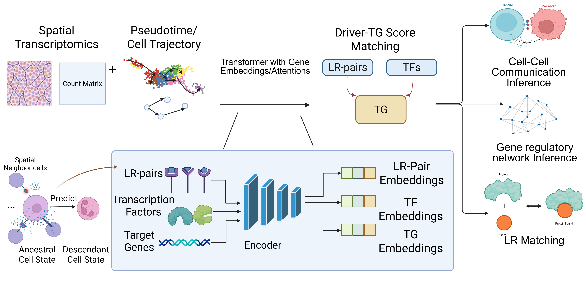

# SpaTRACE: Spatial-temporal recurrent auto-encoder for reconstructing signaling and regulatory networks from spatiotemporal transcriptomics
## Introduction

**SpaTRACE** (Spatial-temporal recurrent auto-encoder for reconstructing signaling and regulatory networks from spatiotemporal transcriptomics) is a pathway-free tool for **cell–cell communication (CCC)** inference, specifically designed for developmental spatial transcriptomics (spatio-temporal transcriptomics) datasets. It captures cellular dynamics across different developmental stages as well as interactions within the surrounding microenvironment, enabling efficient CCC inference in undercharacterized tissues or species.

It enables:  
- **Cell–cell communication analysis**  
- **(Stage-specific) Signalling and Gene regulatory network reconstruction**  
- **Ligand–receptor pair prediction**


### How it works

**SpaTRACE** is a spatiotemporal transformer model trained on sampled cell trajectories from pseudotime. By modeling the temporal dynamics of each **ligand–receptor pair, transcription factor, and target gene** under **L1 regularization**, the model learns embeddings that capture semantic representations of cellular interactions.  

These embeddings can then be used to:  
- Reconstruct **ligand–receptor → target gene** relationships  
- Infer **TF → target gene** regulatory links via score matching  
- Build integrated **cell–cell communication and gene regulatory networks**

### What this repo provides
- A **user-friendly interface** to run SpaTRACE on your own datasets  
- **Documentation and examples** from our experiments on:
  - Simulation Datasets (and their generation code)  
  - Mouse midbrain development  
  - Axolotl brain regeneration
  
The workflow is organized into a **three-step pipeline**:

1. **Data preparation**: Taken an .h5ad data and given lists of ligands, receptors, TFs as inputs, it automatically extract DE genes, perform pseudotime analysis, and prepare input data for the model training.
2. **Model training**: Train the transformer model **SpaTRACE** on the prepared features.  
3. **Downstream analysis**: Perform feature selection and reconstruct ligand–receptor interactions, gene regulatory networks, and cellular interactions.


---
## Pipeline Overview

The pipeline is organized into **three main scripts**:

1. **`run_preprocess.py`**  
   - Constructs spatial and temporal neighborhoods, metacells, and sampled trajectories.  
   - Extracts ligand, receptor, TF, and target features along these paths.  
   - Outputs compact `.npz` bundles for model training and testing.  

2. **`run_experiment.py`**  
   - Trains the **SpaTRACE** transformer model on the preprocessed data.  
   - Produces learned weights, embeddings, and attention maps.  

3. **`run_inference.py`**  
   - Performs gene-level inference of regulatory relationships (**LR → TG**, **TF → TG**, and **L → R**).  
   - Aggregates gene-level and spatial information to predict **cellular-level interactions**.  

---
# Installations

## Requirements

- Python 3.10+
- Packages:
  - `scanpy`
  - `squidpy`
  - `numpy`
  - `scipy`
  - `pandas`
  - `matplotlib`
  - `seaborn`
  - `scikit-learn`
  - `tensorflow` (2.x)
- Plus the included model code: `model/GRAEST_Chat_v1_0.py`

---

## Installation

To install the environment with **pip**, first clone this repository to your local machine. Then, create and activate a fresh conda environment (or a new virtual environment) and install the required packages.

### Install with Conda

```bash
conda create -n spatrace python=3.9 -y
conda activate spatrace

pip install --upgrade pip
pip install -r requirements.txt
```
# Usage
## Step 0: Input Preparation

Before running the pipeline, you must prepare a list of input files under a working directory and follow our naming convention. You need to define a **project name** (`project_name`), abd all input files should be named using this prefix.

### Required Input Files
The pipeline accepts `.h5ad` files as input. Please prepare the following **two stRNA datasets**:

- **`{project_name}_sc_adata.h5ad`**  
  Contains all *receiver cells*, their expression profiles, and pseudotime. If available, also include the UMAP and PCA. 
- **`{project_name}_st_adata.h5ad`**  
  Contains *all cells* (both sender and receiver) with associated expression profiles and spatial information.  

### Gene Lists
Provide text files containing your genes of interest:  

- **`{project_name}_ligand.txt`** — list of ligands  
- **`{project_name}_receptor.txt`** — list of receptors  
- **`{project_name}_tf.txt`** — list of transcription factors  
- **(Optional)** **`{project_name}_tg.txt`** — list of target genes (if omitted, the model will automatically infer target genes)  

### Cell Type Lists
Specify the cell types relevant to your analysis:  

- **`{project_name}_receiver.txt`** — list of receiver cell types  
- **(Optional)** **`{project_name}_sender.txt`** — list of sender cell types (if omitted, the model will use spatially enriched genes surrounding the receiver cells)  

## Step 1: Preprocessing
With the input data provided as in Step 0, our model will preprocess the data and sample cell trajectories as the input of model training. Please provide the following parameters (Here we use simulation data 1 as an example):
### Run
```bash
python run_preprocess.py \
  --data_dir ./experiments/simulation \
  --project_name simulation \
  --batch_key batch \
  --annotation_key 'Cell Types' \
  --pt_key dpt_pseudotime \
  --sp_key spatial \
  --n_neighbors 10 \
  --path_len 3 \
  --num_repeats 10 \
  --k_primary 5 \
  --skip_de \
  --radius 5 \
  --n_jobs -1 \
  --simulation_data
```
## Arguments explained
- `--data_dir` – working directory where you saved the input files.  
- `--project_name` – project name (also used as the base filename).  
- `--batch_key` – column in `obs` storing batch info.  
- `--annotation_key` – column in `obs` with cell type annotations.  
- `--pt_key` – pseudotime key (e.g., `dpt_pseudotime`).  
- `--sp_key` – key in `.obsm` for spatial coordinates.  
- `--n_neighbors` – number of neighbors to aggregate metacells (default: 10).  
- `--path_len` – sampled path length (default: 3).  
- `--num_repeats` – number of sampling paths for each metacell (default: 10).  
- `--k_primary` – closest *k* temporal neighbors considered as potential descendants (default: 5).  
- `--skip_de` – skip the differential expression step; use this if you want to include all ligands, receptors, TFs, and TGs directly.  
- `--radius` – neighborhood radius (default: 50; here set to 1).  
- `--n_jobs` – number of parallel tasks (default: `-1` uses all available CPUs).  

## Outputs
## Output directory structure

```bash
outputs_preprocess/
├── data_triple/
│   ├── MyProj_tensors_train.npz         # bundled training tensors
│   ├── MyProj_tensors_test.npz          # bundled testing tensors
│   ├── recep_array_train.npy            # receptor expressions (train)
│   ├── ligand_array_train.npy           # ligand expressions (train)
│   ├── tf_array_train.npy               # transcription factor expressions (train)
│   ├── target_array_train.npy           # target gene expressions (train)
│   ├── label_array_train.npy            # labels (train)
│   ├── lr_pair_array_train.npy          # ligand–receptor pair info (train)
│   ├── all_paths_train.npy              # sampled paths (train)
│   ├── recep_array_test.npy             # receptor expressions (test)
│   ├── ligand_array_test.npy            # ligand expressions (test)
│   ├── tf_array_test.npy                # transcription factor expressions (test)
│   ├── target_array_test.npy            # target gene expressions (test)
│   ├── label_array_test.npy             # labels (test)
│   ├── lr_pair_array_test.npy           # ligand–receptor pair info (test)
│   ├── all_paths_test.npy               # sampled paths (test)
│   └── fig/                             # diagnostic plots
├── MyProj_ligands.txt                   # identified ligands
├── MyProj_receptors.txt                 # identified receptors
├── MyProj_tfs.txt                       # identified transcription factors
├── MyProj_tgs.txt                       # identified target genes
├── MyProj_receivers.txt                 # receiver cell types
└── MyProj_senders.txt                   # sender cell types

```
## Step 2: Training & Experiment

After extracting essential genes and sampling the cell trajectories, you can call `run_experiment.py` to train the recurrent autoencoder on the data.  
The model will extract embeddings, model weights, and global attention scores between drivers and TGs, saving them under the user-provided output directory.  
If specified, per-cell attentions and visualizations can also be saved.  

Here we use the simulation data as an example.

### Run

```bash
python run_experiment.py \
  --data_dir ./experiments/simulation \
  --project simulation \
  --out_dir ./experiments/simulation/results \
  --d_model 128 \
  --dff 128 \
  --num_heads 3 \
  --epochs 50 \
  --tlength 3 \
  --batch_size 16 \
  --save_visuals
```
## Arguments explained

- `--data_dir` – same working directory used in `run_preprocess.py`.  
- `--project` – project name (must match the preprocess step).  
- `--out_dir` – directory for experiment outputs.  
- `--d_model` – embedding size for the model.  
- `--dff` – hidden layer size in the feedforward block.  
- `--num_heads` – number of attention heads.  
- `--epochs` – number of training epochs.  
- `--tlength` – trajectory path length.  
- `--batch_size` – batch size for training.  
- `--save_visuals` – save driver → TG attention visualizations.  
- `--save_percell_attentions` – save per-cell attention matrices.  

## Outputs
```bash
outputs_experiment/
├── weights/                        # trained model weights
│   └── weights.weights.h5
├── embeddings/
│   ├── global_embeddings/           # global embeddings across cells
│   │   ├── embeddings_batch_0000.npz
│   │   ├── embeddings_batch_0001.npz
│   │   └── ...
│   └── percell_embeddings/          # per-cell embeddings
│       ├── embeddings_batch_0000.npz
│       ├── embeddings_batch_0001.npz
│       └── ...
└── attentions/
    ├── global_attentions/           # top-k global attention scores
    │   ├── attn_global_tf_topk_batch_0000.npz
    │   ├── attn_global_lr_topk_batch_0000.npz
    │   └── ...
    └── percell_attentions/          # per-cell attention scores
        ├── attn_percell_tf_topk_batch_0000.npz
        ├── attn_percell_lr_topk_batch_0000.npz
        └── ...
```

## Step 3: Inference & Post-Processing

After training, you can run `run_inference.py` to aggregate and interpret the results.  
This script performs several levels of analysis on GRAEST outputs:

- **Gene-level aggregation**:  
  Aggregates per-cell embeddings into per-stage TF→TG and LR→TG interaction intensities.  
  Summarizes global attentions into LR intensities.

- **Cellular-level aggregation**:  
  Combines stage-specific matrices into cell-type–to–cell-type communication intensities.  
  Generates heatmaps and CSVs for sender–receiver pairs.

- **Visualization (optional)**:  
  Saves heatmaps, bar plots, and other figures for global and per-cell interactions.

---

### Run

```bash
python run_inference_percell.py \
  -d experiments/mouse_midbrain_progenitor_cell_development \
  -i experiments/mouse_midbrain_progenitor_cell_development/results_250_hvg_5 \
  -o experiments/mouse_midbrain_progenitor_cell_development/analysis_250_hvg_5 \
  -n Dorsal_mouse_midbrain_250_hvg_5 \
  --extract_percell_attn  \ # For GRN and LR inference, this is not required.
  --sc_adata_path experiments/mouse_midbrain_progenitor_cell_development/Dorsal_mouse_midbrain_250_hvg_5/Dorsal_mouse_midbrain_250_hvg_5_adata_processed.h5ad \
  --model_path experiments/mouse_midbrain_progenitor_cell_development/results_250_hvg_5/weights/weights.weights.h5
```
## Arguments explained
# Required:
   --data_dir       Root data directory that contains the preprocessed project folder.
                    Expected:
                      data_dir/<project_name>/<project_name>_ligands.txt
                      data_dir/<project_name>/<project_name>_receptors.txt
                      data_dir/<project_name>/<project_name>_lr_pairs.txt
                    Also used for attention extraction to recover model dims from:
                      data_dir/<project_name>/data_triple/<project_name>_tensors_train.npz

   --input_dir      Experiment output directory from run_experiment.py.
                    Expected:
                      input_dir/attentions/global_attentions/gated_global_lr_full.npz
                      input_dir/<percell_att_relpath>/meta_gene_orders.npz
                      input_dir/<percell_att_relpath>/percell_*.npz

   --out_dir        Output directory for this script.
                    Writes:
                      out_dir/gene_interactions/*
                      (optional) out_dir/plots/*

   --project_name   Project prefix used by preprocess (e.g., MyProj).

 Logging:
   --log_level      Python logging level (e.g., INFO, DEBUG or 20). Default: INFO

 -----------------------------
# Global LR inference controls
 -----------------------------
   --global_topk_per_col   Keep only top-k LR entries per TG column before aggregation (global).
                           Default: None

   --global_top_n_bar      Passed through to aggregate_LR_intensity for compatibility.
                           This script itself does NOT save figures. Default: 20

 -----------------------------
# Per-cell LR inference controls
 -----------------------------
   --skip_percell               Skip per-cell LR inference entirely.

   --percell_top_k              Within each TG column, keep only top-k LR entries before rowwise nonzero mean.
                                Default: None

   --percell_n_permutations     Permutations for TG-column permutation test. Default: 1000

   --percell_gene_top_k         Keep gene_top_k TG columns with smallest p-values. Default: None

   --percell_gene_alpha         If gene_top_k is None, keep TG columns with p <= gene_alpha.
                                Default: 0.05/20

   --percell_random_state       RNG seed for permutation test. Default: 0

   --percell_save_mean_lrtg     Also save filtered mean LR×TG matrix as NPZ. Default: False

 -----------------------------
# Per-cell attention path / extraction
 -----------------------------
   --percell_att_relpath        Relative path under input_dir to per-cell attention directory.
                                Default: attentions/percell_attentions

   --extract_percell_attn       If set, run per_cell_att_compute(...) to create:
                                  meta_gene_orders.npz
                                  percell_*.npz

   --percell_att_out_relpath    Where to write extracted per-cell attentions under input_dir (relative path).
                                Default: attentions/percell_attentions

   --sc_adata_path              Required if --extract_percell_attn. Path to single-cell .h5ad for extraction.

   --model_path                 Required if --extract_percell_attn. Path to trained model weights.

 -----------------------------
# Optional plotting
 -----------------------------
   --plot_adata_path     Spatial .h5ad used ONLY for plotting (must contain obsm['spatial'])
   --plot_lr_pair        Plot LR spatial heatmap for '<ligand>_to_<receptor>' using percell_lrscore_percell(.npz)
   --plot_tf             Plot TF spatial heatmap using percell_*.npz
   --plot_stage          Optional suffix for resolving percell_lrscore_percell__{stage}.npz
   --plot_point_size     Point size for scatter. Default: 1.0
   --plot_cmap           Matplotlib colormap. Default: Reds

## Outputs
 -----------------------------
 Outputs (directory layout)
 -----------------------------
 Always:
   out_dir/gene_interactions/
     - Global LR inference outputs written by aggregate_LR_intensity(...)
       (exact filenames depend on your aggregate_LR_intensity implementation)

 If per-cell inference runs (default):
   out_dir/gene_interactions/
     - percell_lrscore_percell.npz
     - (optional) percell_lrscore_percell__<stage>.npz   # if you use --plot_stage naming
     - (optional) mean LR×TG filtered matrix as NPZ      # if --percell_save_mean_lrtg

 If plotting flags are provided:
   out_dir/plots/
     - attnmap_lr__<ligand>_to_<receptor>.png
     - attnmap_tf__<TF>.png
```
